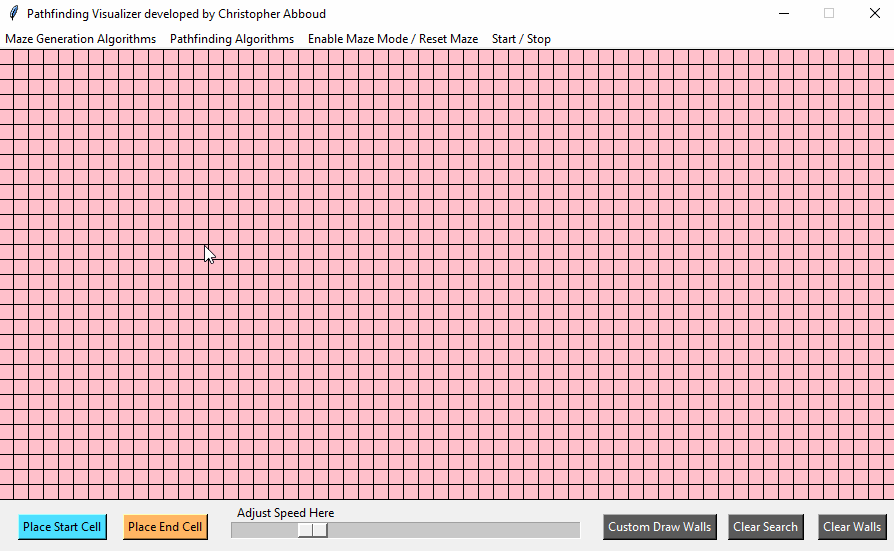
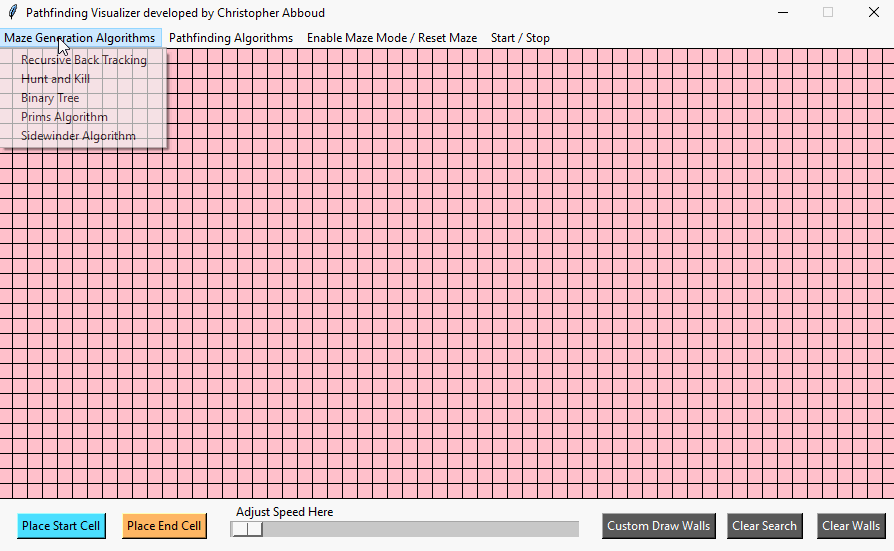
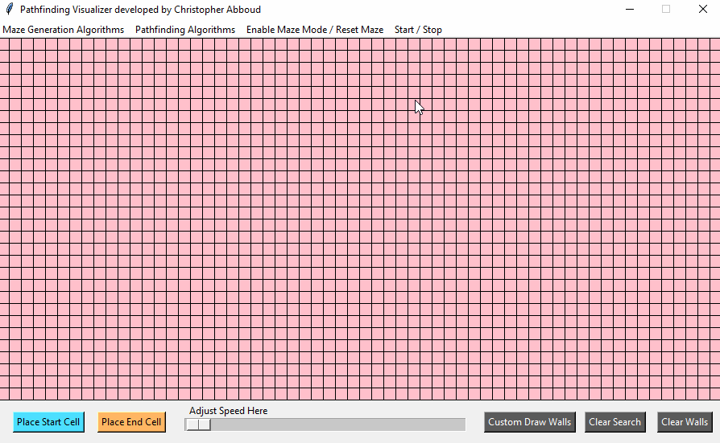
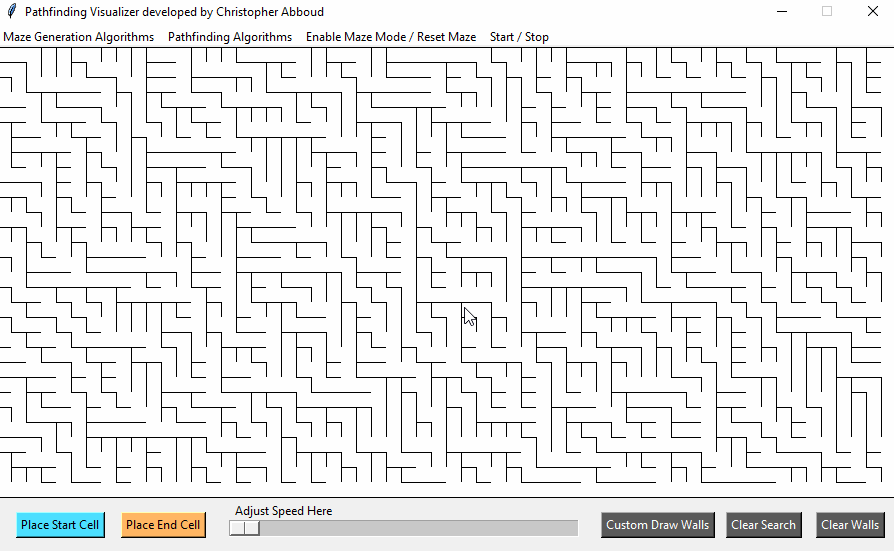

# Maze Generation / Pathfinding Visualizer

This software was created for the purpose to easily visualize some of the different popular pathfinding and maze generation algorithms. This way one can observe the differences between them and better their conceptual understanding of them.

### Currently Supported Maze Generation Algorithms:
> - Recursive Back Tracking
> - Hunt and Kill
> - Binary Tree
> - Prims Algorithm
> - Sidewinder Algorithm

### Currently Supported Path Finding Algorithms: 
> - Djikstras
>- A*

More algorithms are planned on being added in the future.

---

# Installation

To ensure that this software will operate on your machine, python must be first installed. Moreover, this software uses tkinter, a GUI library, please follow  [these instructions](https://www.tutorialspoint.com/how-to-install-tkinter-in-python) on how to install tkinter. After that, simply `git clone` the repository and run Main.py and the software should launch.

---
# Instructions
When using this software, there is 3 steps in order you need to follow. These steps will be explained more indepth below. 
1. Generate / Manually draw a maze or obstacles
2. Place the start and end cells
3. Run a pathfinding Algorithm

## Generating a Maze

Upon first starting the software, you will be greeted with a pink checkerboard looking grid. This means that you are in algorithmic maze generation mode. To generate a maze from this point, simply click on the "Maze Generation Algorithms" button, followed by clicking on any of the selections from the drop down menu. You will now be able to visually see how the chosen algorithm is working. You can see a demonstration of this below. Please note the Pause/Play button towards the top, and the speed slider at the buttom. We will go more indepth about these later.

---

---

### If you would like to generate a new maze, there are multiple ways to do this.
1. If you have a maze algorithm that is currently working but not finished, first pause the algorithm by pressing the "Start / Stop" button. After the algorithm has paused, then click on the "Enable Maze Mode / Reset Maze" to bring up a new fresh grid.
2. If the algorithm has already finished, simply click on the "Enable Maze Mode / Reset Maze" button.

Those are all hte instructions for using the maze mode. Here is some important things to note when using a maze generation algorithm. 
1. You must be in Maze Mode to use a maze generation algorithm.
2. You can not call a new maze generation algorithm unless the algorithm is paused or the grid is cleared.

---

## Manually drawing obstacles
Sometimes you may want to manually draw your own obstacles. To do so, you must enter drawing mode. To do this, click on the "Custom Draw Walls" button to enable drawing mode. Please note, to enter drawing mode there must not be any algorithm currently running or the algorithm that was running must be paused. Once you enter drawing mode, you will see the grid turn to all white. To draw walls, use your mouse to click and drag where you would like to place walls. You can see a demonstration of this below.

If you would like to delete the walls you have drawn, press the "Clear Walls" button. Also note the "Clear Search" button, we will go over this later.

---

## Placing Start and End Cells
In order for you to be able to place start and end cells, you must either have a maze completed maze drawn through a maze generation algorithm, or you must be in drawing mode. You will use the start and end cells for the pathfinding algorithms. As the name suggests, the pathfinding algorithm will start at the start cell, and search for the end cell.

To place the start cell, first click on the "Place Start Cell" button. After you click this button, the next click that you do will be where this cell will be placed. The same applies for the End Cell. You can see a demonstration of this below. 

You can not place cells on manually drawn walls.

If you are currently in drawing mode, and you would like to draw more walls after you have placed cells, simply click on the "Custom Draw Walls" button to rebind your mouse to click and drag to draw more walls.

If you would like to reposition the cells at any point, this is possible aslong as no algorithm is running and no algorithm is paused. To reposition a cell, simply re-click the "Place Start Cell" or "Place End Cell" button, and click on your desired new location.

---

## Running a pathfinding Algorithm

Once you have either generated a maze or manually drawn walls, as well as placed your start and end cells, you can finally use a pathfinding algorithm! To do this, simply click on the "Pathfinding Algorithms" button at the top, and select your desired algorithm. You will now be able to see it visually working! You can see an example of this below.

If you would like to run a new pathfinding algorithm, simply click on the "Clear Search" button to clear the data from the search, and then simply select your new algorithm. You are not required to generate a new maze / draw new walls anytime you want to use a differenet pathfinding algorithm. This lets you experiment and see how the different algorithms can compete on the same obstacles.

After a path is found, a yellow trail will be drawn to show the solution.

If you want to slow down the algorithm, simply click the slider towards the button and drag it either to the right to slow down the algorithm, or to the left to speed it up.

---

## Adjusting Speed Slider & Using Start / Stop
There are two other universal controls in this software. Lets first talk about the speed slider towards the bottom. Any any of the maze generation / pathfinding algorithms, if you would like to speed it up / slow it down you can click and draw the slider either to the right to slow it down, or to the left to speed it up. Note you are not required to pause the algorithm to adjust its speed, you can adjust the speed while the program is running. This allows you to observe specifically what is happening and what steps the algorithm is taking.

The other universal button is the Start / Stop button. On any of the maze / pathfinding algorithms in the program, you can pause / play them by using this button. 

You can see an example of using the speed slider and the start / stop button below.

---

You are now able to visualize many of the popular pathfinding and maze generation algorithms! Experiment and see if you can predict what the algorithms wll do before you run them.